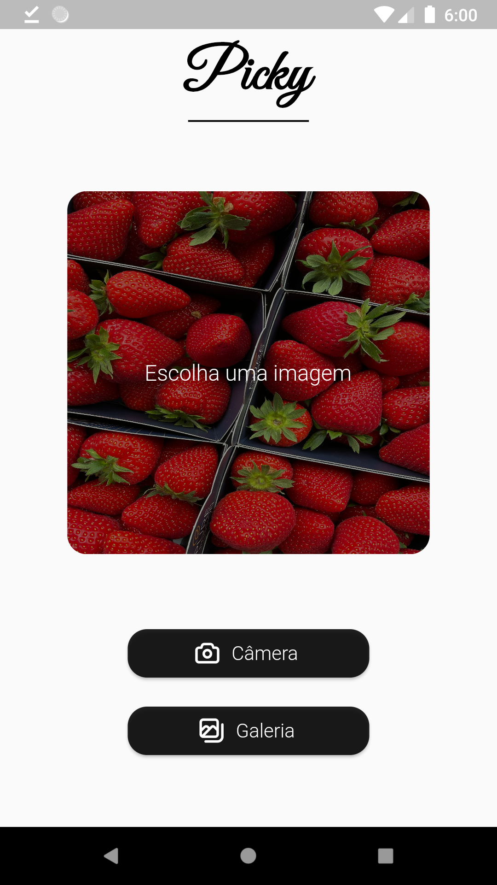

# Picky

Aplicativo referente a entrega do build da Instruction 2. É um aplicativo simples que seleciona uma imagem da câmera ou galeria do celular e exibe-a na tela.
Caso se interesse pela versão anterior do aplicativo, assim como um guia para iniciantes em Flutter, cheque [este repositório.](https://github.com/Projeto-Frutas-Vegetais-Programa-K/prototipo-flutter)

## Preview

     
